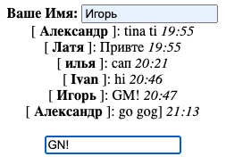

# Simple Messenger

## Description
    
- The `main task` was to create a backend for the messenger and upload everything to the server.
- There were already two functions in `form.html`: sendMessage(), loadMessages(). The `Json file` served as an alternative to the database. The messenger was uploaded to the `cloud` and the `VM` was separately configured.
- Difficulties have arisen solely with downloading and launching on a VM.
- Of the new things I've learned `Flask`.

## Table of Contents 

- [Technology stack](#technology-stack)
- [Installation](#installation)
- [Usage](#usage)
- [Contributing](#contributing)
- [Contacts](#contacts)


## Technology stack


## Installation

1. Clone the repo
   ```shell
   git clone https://github.com/1vokahsu/Simple-Messenger.git
   ```
2. Install the `flask` library before starting
   ```shell
   pip install Flask -y 
   ```
3. Run `main.py` and then the console will show 2 IP addresses, one internal and one public.
   ```shell
   * Running on http://internal_ip:port
   * Running on http://public_ip:port
   ```
4. Open the browser and enter the search bar `http://public_ip/chat`

## Usage

```markdown
   Messenger.
   How do you use it?
   Write a name, write a message, press enter, done!
   All messages, names and the time at which they were sent are saved and when restarted are loaded from json file.
```
An example of how a messenger works:



## Contributing

Contributions are what make the open source community such an amazing place to learn, inspire, and create. Any contributions you make are **greatly appreciated**.

If you have a suggestion that would make this better, please fork the repo and create a pull request. You can also simply open an issue with the tag "enhancement".
Don't forget to give the project a star! Thanks again!

1. Fork the Project
2. Create your Feature Branch (`git checkout -b feature/AmazingFeature`)
3. Commit your Changes (`git commit -m 'Add some AmazingFeature'`)
4. Push to the Branch (`git push origin feature/AmazingFeature`)
5. Open a Pull Request

## Contacts

[](https://t.me/svokahsu)
[](https://github.com/1vokahsu)